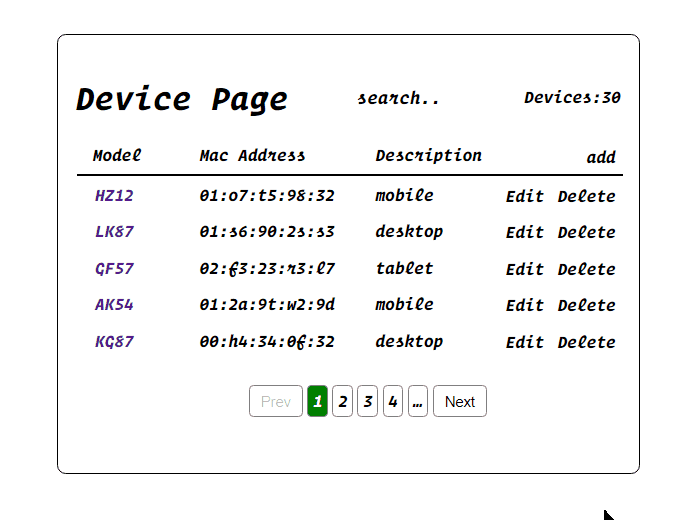

# Telsmart DSS Device Buttons



### Installation process :

- clone repo
- navigate to project folder
- install all dependencies with yarn or npm
- run with yarn or npm


```bash
$ git clone https://github.com/RandolphG/Product.Page.git
$ cd project
$ yarn or npm i
$ yarn dev or npm run dev
```
